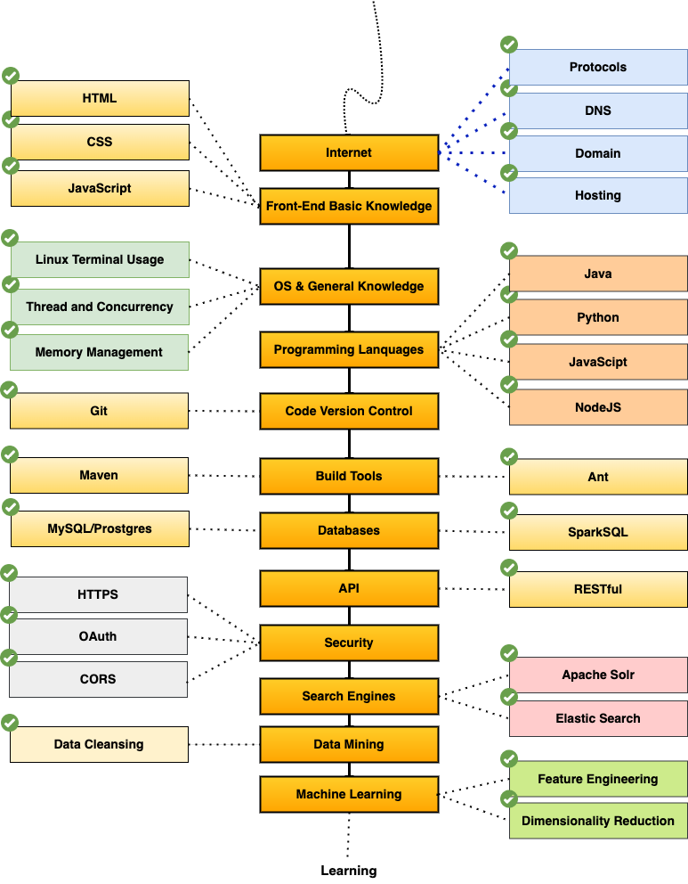

### Hello there 👋

I am a Software Engineer with a Masters degree in Computer Science from Arizona State University. I have 8 years of work experience in the tech industry. My technical forte is back-end development, big data, machine learning, designing software using design patterns and other industry best practices, software architecture using MVC, Agile methodology, etc.

I am comfortable with Java ☕, Python 🐍, JavaScript, Express, NodeJS, Android, Spark, SQL, C, and C++. 

I'm flexible to pick up any technology, learn it, and work with it quickly. You can check my projects [here](https://github.com/sachinaraballi?tab=repositories).

Some things about me:

- 🔭 I have a Master's Degree from Arizona State University.
- 🌱 I’m learning application development using big data and machine learning technologies.
- 👯 I’m open to collaborating on Full Stack application development.
- 💬 Ask me about Web development, Java, Software Design, OOPS concepts, and Software Architecture.
- 📫 How to reach me: DM me on [LinkedIn](https://www.linkedin.com/in/sachinaraballi/) or email me at [sachinaraballi@gmail.com](mailto:sachinaraballi@gmail.com)
- 😄 Pronouns: He/Him/His
- ⚡ Articles: 
   - https://medium.com/@sachinaraballi/learn-dynamic-programming-using-coin-change-problem-1e9ce470c343
- 🌎 My Tech Path:

